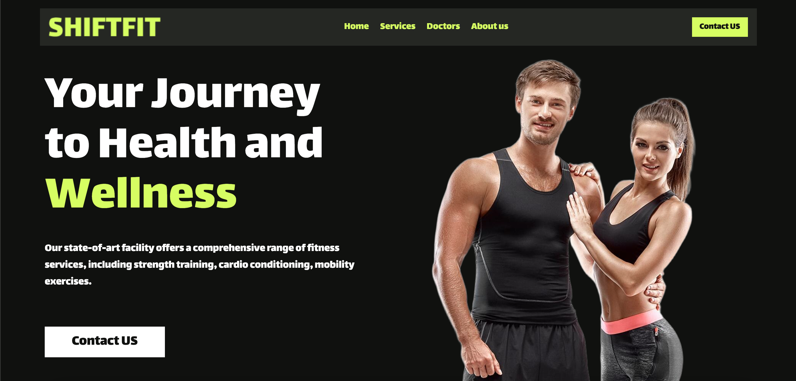

# ShiftFit - Modern Fitness Website

A modern, responsive fitness website built with React, TypeScript, and Tailwind CSS. This project showcases a premium gym facility with features like video presentations, image galleries, and interactive components.



## 🚀 Features

- **Modern Design**: Clean and professional UI with attention to detail
- **Fully Responsive**: Works seamlessly on desktop, tablet, and mobile devices
- **Interactive Components**:
  - Video player with custom controls
  - Image galleries with hover effects
  - Animated scrolling banner
  - Dynamic navigation
  
- **Performance Optimized**:
  - Lazy loading images
  - Optimized video playback
  - Smooth animations

## 🛠️ Technologies Used

- **Frontend Framework**: React with TypeScript
- **Styling**: Tailwind CSS
- **Icons**: React Icons
- **Animations**: Custom CSS animations
- **Version Control**: Git
- **Package Manager**: npm/yarn

## 📦 Installation

1. Clone the repository:
```bash
git clone https://github.com/yourusername/shiftfit.git
```

2. Navigate to the project directory:
```bash
cd shiftfit
```

3. Install dependencies:
```bash
npm install
# or
yarn install
```

4. Start the development server:
```bash
npm run dev
# or
yarn dev
```

5. Open [http://localhost:5173](http://localhost:5173) to view it in the browser.

## 🏗️ Project Structure

```
shiftfit/
├── src/
│   ├── assets/          # Images, videos, and other static files
│   ├── components/      # React components
│   │   ├── About.tsx
│   │   ├── GallerySection.tsx
│   │   ├── HeroSection.tsx
│   │   ├── ScrollingBanner.tsx
│   │   ├── TitleSection.tsx
│   │   └── VideoSection.tsx
│   ├── App.tsx         # Main application component
│   └── index.css       # Global styles
├── public/             # Public assets
├── package.json        # Project dependencies and scripts
└── README.md          # Project documentation
```

## 🎨 Components

- **HeroSection**: Main landing section with call-to-action
- **ScrollingBanner**: Animated text banner with fitness-related content
- **About**: Information about the gym and its services
- **VideoSection**: Video showcase with custom play controls
- **GallerySection**: Image gallery showcasing gym facilities
- **TitleSection**: Reusable component for section titles

## 🔧 Configuration

The project uses Vite for development and building. You can modify the configuration in:
- `vite.config.ts` for build settings
- `tailwind.config.js` for Tailwind CSS customization
- `tsconfig.json` for TypeScript settings

## 📱 Responsive Design

The website is fully responsive with breakpoints at:
- Mobile: < 640px
- Tablet: 640px - 1024px
- Desktop: > 1024px

## 🤝 Contributing

1. Fork the repository
2. Create your feature branch (`git checkout -b feature/AmazingFeature`)
3. Commit your changes (`git commit -m 'Add some AmazingFeature'`)
4. Push to the branch (`git push origin feature/AmazingFeature`)
5. Open a Pull Request

## 📄 License

This project is licensed under the MIT License - see the [LICENSE](LICENSE) file for details.

## 👥 Credits

- Design inspiration from modern fitness websites
- Images from [source-of-your-images]
- Icons from [React Icons](https://react-icons.github.io/react-icons/)

## 📞 Contact

Mohamed Lazaar - [@CodeWith_ML](https://x.com/CodeWith_ML) - lazzarmohamed10@gmail.com
Portfolio - [Portfolio](https://mohamedlazaar-portfolio-360.vercel.app/)
Linkedin - [@mohamed-lazaar](https://www.linkedin.com/in/mohamed-lazaar)


Project Link: [https://github.com/mohamedlazaar/shift_fitness](https://github.com/mohamedlazaar/shift_fitness)
